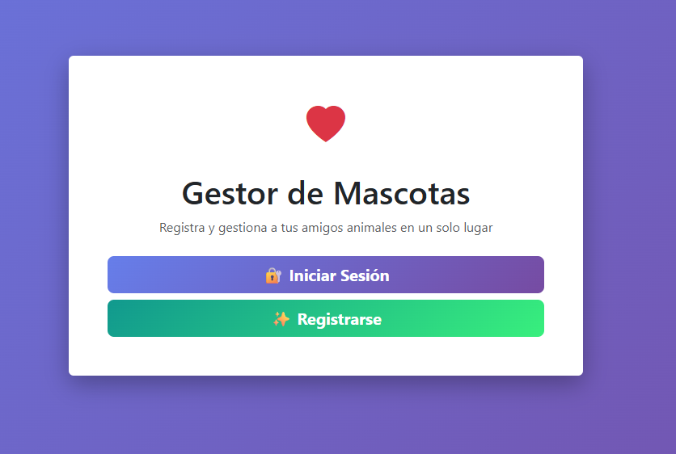
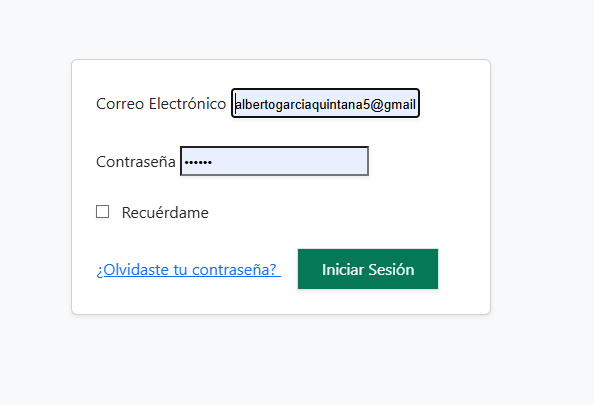
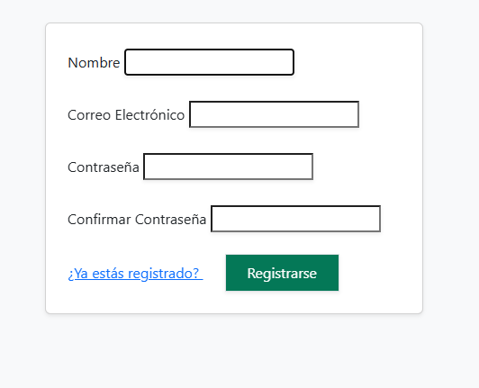
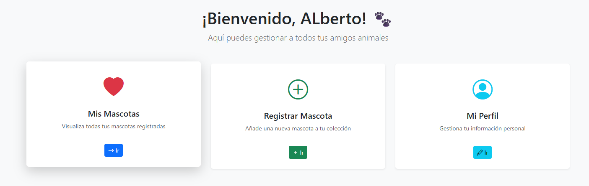
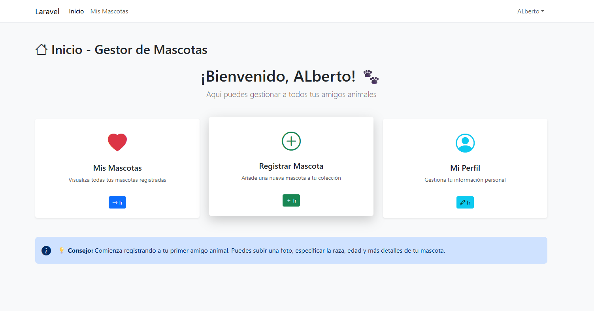
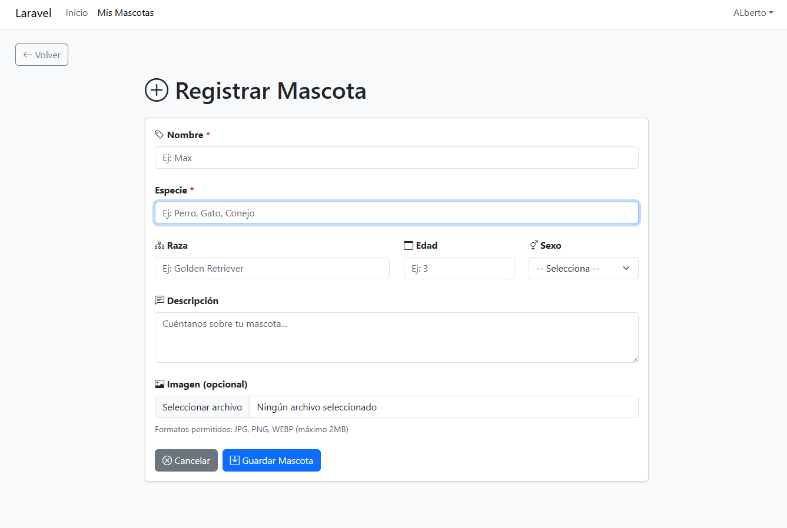
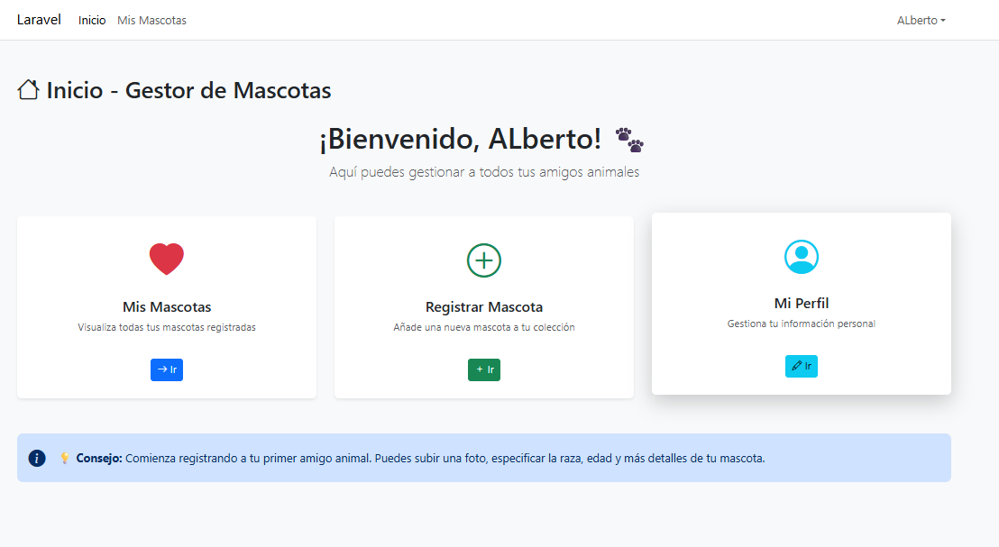

# 🐾 Gestor de Mascotas con Laravel

Un CRUD completo para registrar y gestionar tus mascotas con **login seguro** y una **interfaz bonita** con Bootstrap.

---

##  ¿Qué es esto?

Es un proyecto que te permite:
-  **Registrarte** con tu correo y contraseña
-  **Crear, editar y eliminar** mascotas
-  **Subir fotos** de tus animales
-  **Ver todas tus mascotas** en una lista organizada
-  Todo protegido: solo ves TUS mascotas

---

## Como funciona

### 1) Registro y acceso
El usuario se registra con email y password y entra a su panel.

Captura:




Explicacion de la captura:
- Aqui esta el inicio de la web y los formularios de iniciar sesion y registrarse

### 2) Lista de mascotas
Muestra todas las mascotas del usuario con opciones de ver, editar o borrar.

Captura:



Explicacion de la captura:
- Aqui se ve la senccion donde puedes ver a tus mascotas tiene botones donde puedes ver sus datos, editarlo o eliminarlos

### 3) Crear o editar mascota
Formulario con datos basicos y foto opcional.

Captura:


Explicacion de la captura:
- (Describe aqui lo que se ve y que accion se realiza)

### 4) Detalle de mascota
Pantalla con toda la informacion de la mascota y su imagen.

Captura:



Explicacion de la captura:
- Aqui esta la seccion de registrar a tu mascota, debes poner su nombre, raza, edad, sexo, hasta una imagen suya

---

### 5) Gestión de tu perfil




Explicacion de la captura:
- Aqui puedes editar a tu usuario o incluso eliminarlo, para eso necesitas poner su contraseña

---

## Requisitos

Necesitas tener instalado en tu PC:
- **PHP** 8.1 o superior
- **MySQL** (con XAMPP va genial)
- **Composer** (el gestor de paquetes de PHP)
---

## Instalación (¡Es fácil!)

### 1️⃣ Clona o descarga el proyecto

```bash
git clone https://github.com/albertogarciaquintana5-jpg/DAW_EJERCICIOS/tree/main/DWES/2eva/Crud-laravel
cd Crud-laravel
```

### 2️⃣ Instala las dependencias

```bash
composer install
```

### 3️⃣ Crea el archivo `.env`

```bash
cp .env.example .env
```

### 5️⃣ Configura la base de datos

Abre `.env` y modifica estas líneas:
```
DB_CONNECTION=mysql
DB_HOST=127.0.0.1
DB_PORT=3306
DB_DATABASE=crud_laravel
DB_USERNAME=root
DB_PASSWORD=
```

### 6️⃣ Crea la base de datos

En **phpMyAdmin**:
- Copia lo que hay en `database/schema.sql` y importelo en su sql le saldra una advertencia abajo pero si recarga vera que se le crea todo correctamente.

### 7️⃣ Ejecuta las migraciones

```bash
php artisan migrate
```

### 9️⃣ Crea el link de almacenamiento

```bash
php artisan storage:link
```

### 🔟 ¡A funcionar!

```bash
php artisan serve
```

Si `php artisan serve` falla por `vendor/autoload.php`, primero ejecuta `composer install`.

Abre tu navegador en **http://127.0.0.1:8000** 🎉

## 🎨 Características principales

| Función | Descripción |
|---------|------------|
| **Registrarse** | Crear cuenta nueva con email |
| **Login** | Acceder con tu cuenta |
| **Crear mascota** | Formulario con nombre, especie, edad, foto... |
| **Ver mascotas** | Lista de todas tus mascotas |
| **Editar mascota** | Cambiar datos o foto |
| **Eliminar mascota** | Borrar una mascota (¡cuidado!) |
| **Ver detalles** | Pantalla con toda la info de la mascota |

---

## Autor

ALberto Garcia Quintana 


